# 3维-可变形 钢筋混凝土简支梁模拟三种加载方式模拟

## 简述

### 简支梁模型

简支梁的两端放置在支座上，一端铰支座，另一端为滚动支座。本文讨论钢筋混凝土简支梁，混凝土为普通强度混凝土，钢筋网纵筋、架立筋、箍筋间距均为等距，三种加载方式，包括均布荷载、单点跨中加载、三分点加载，各模型示意图如下：


| 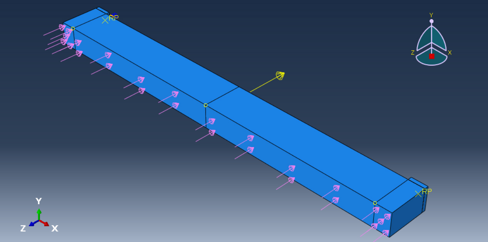     | 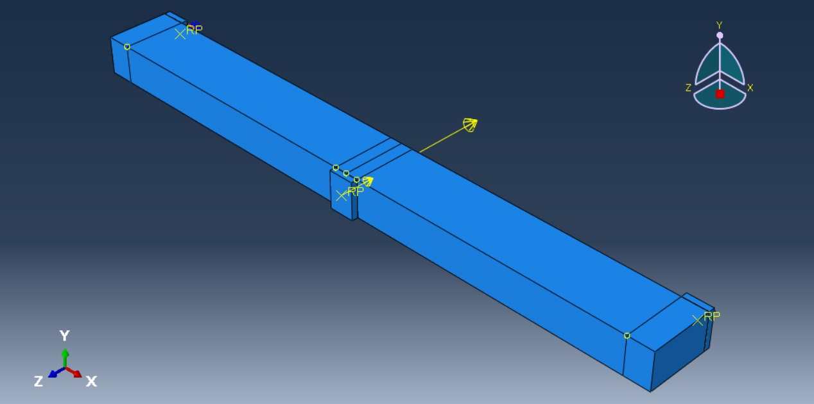     |      |
|----------------------------|------------------------------|-----------------------------|
| <p align="center">均布加载</p> | <p align="center">单点跨中加载</p> | <p align="center">三分点加载</p> |

梁的尺寸参数：

| 长    | 宽   | 高   | 保护层厚                     | 底部受拉筋                                                            | 架立筋                                                              | 箍筋                                                                 |
|------|-----|-----|--------------------------|------------------------------------------------------------------|------------------------------------------------------------------|--------------------------------------------------------------------|
| 5000 | 300 | 500 | <p align="center">25</p> | <p align="center">318</p> | <p align="center">212</p> | <p align="center">8@200</p> |

钢垫片尺寸为 200mm X 200mm，尺寸需参考规范 6.6 章节确定，保证局部受压承载区截面尺寸满足要求，结构合理即可。

### 材料本构

#### 1. 钢筋本构
结合[第 0 章](0_ReinBarTest.md)钢筋的模拟，在简支梁模拟案例中，钢筋本构关系仍然使用双折线模型。

#### 2. 刚性较大的钢材本构
钢垫块的材料属性和钢筋的区别在于，因为假设刚度足够大，所以不考虑塑性属性。

<p align = "center">

</p>

#### 3. 混凝土本构
混凝土塑性属性使用 CDP 塑性损伤模型，本构计算方法依据[《混凝土结构设计规范》GB50010-2010 (2024年版)](https://www.mohurd.gov.cn/gongkai/zc/wjk/art/2024/art_17339_778180.html).


## 二次开发目标
- 使用 Python 计算 CDP 各参数取值
- 梁、钢筋、垫块尺寸参数可调
- 提供子部件实现方法
- 可选择三种加载方式


## 混凝土本构 CDP
### 1. 通用属性
在 ABAQUS 中，混凝土作为一种材料，首先具有一般材料属性密度，混凝土质量密度在 mm 单位制下，一般为 2.2 E -09 ~ 2.4 E -09 tone/mm<sup>3</sup>。

### 2. 弹性属性


弹性属性包括弹性模量和泊松比，泊松比可取 0.2，弹性模量按试验实测，或者规范取值，也可按如下公式计算：

<p align = "center">

</p>

f<sub>cu,k</sub>为立方体抗压强度标准值。

### 3. 塑性属性

CDP 是用于模拟混凝土在复杂受力下（拉压、循环荷载等）塑性变形与损伤演化的本构模型。

#### 基本塑性参数

为确定混凝土的一般塑性力学行为，在 ABAQUS 中需要确定基本塑性参数，建议取值可如下表：


#### 受压/受拉行为
为确定单轴受压、受拉状态下的塑性力学行为，本文依据《混凝土结构设计规范》进行计算，规范中，单轴受压、受拉关系如下公式描述：

| 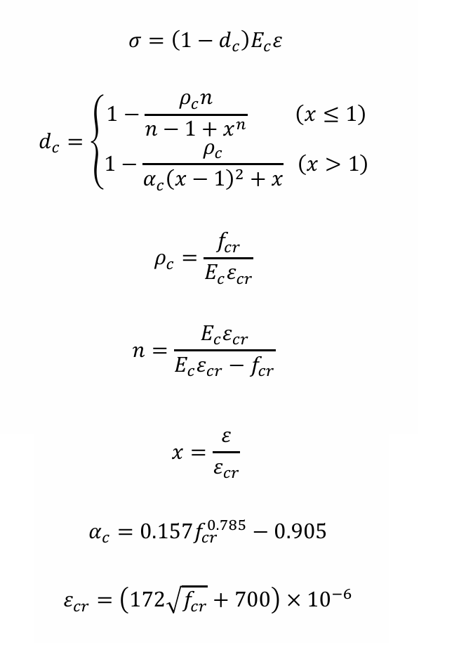        | 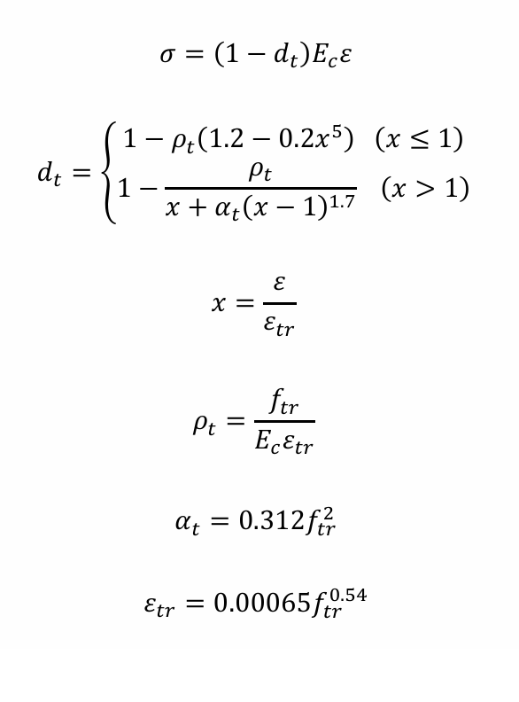        |
|----------------------------------|----------------------------------|
| <p align="center">混凝土受压本构计算式</p> | <p align="center">混凝土受拉本构计算式</p> |

单轴拉压应力-应变曲线如下：

| 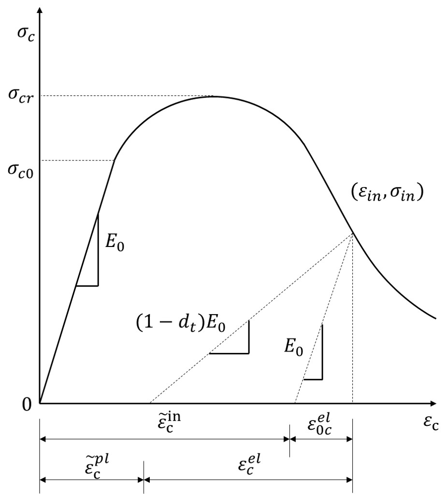        | 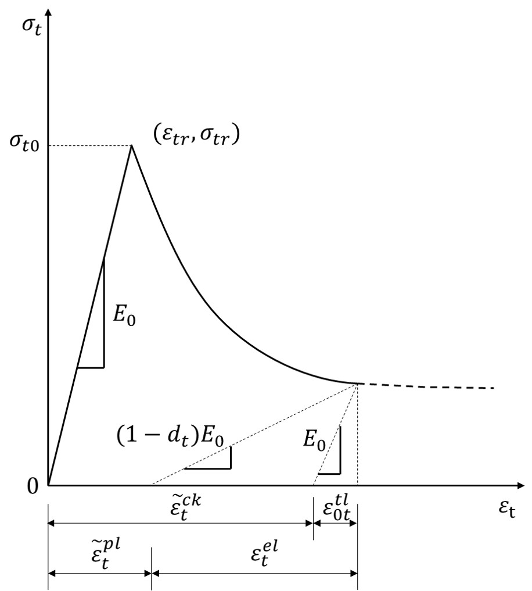        |
|------------------------------|------------------------------|
| <p align="center">受压本构曲线</p> | <p align="center">受拉本构曲线</p> |

其中：
* x - 横坐标取值
* f<sub>cr</sub> - 单轴抗压强度代表值，可取 f<sub>c</sub>、f<sub>ck</sub>、f<sub>cm</sub> (N/mm^2)
* f<sub>tr</sub> - 单轴抗拉强度代表值，可取 f<sub>t</sub>、f<sub>t</sub>、f<sub>tm</sub> (N/mm^2)
* E<sub>c</sub> - 弹性模量
* d<sub>c</sub> - 压损伤演化参数
* d<sub>t</sub> - 拉损伤演化参数
* ε<sub>cr</sub> - 峰值压应变
* ε<sub>tr</sub> - 峰值拉应变

从公式中可以看出，当我们提供确定的 x、fcr、ftr、Ec 后，可以计算混凝土的拉、压应力σ、应变ε。将应力、应变带入下式可以计算拉、压状态下的损伤因子：

<p align = "center">    

</p>

上述计算过程计算的是名义应力、名义应变，对于 ABAQUS 而言，需要输入真实应力、真实应变，可以通过如下公式换算：

<p align = "center">    

</p>

对于 ABAQUS 而言，应力从材料的屈服应力开始，且应变也应该为减去弹性应变后的非弹性应变，也就是从应力应变曲线接近直线的弹性段的最后一个点开始，该点对应的非弹性应变应该为 0, 该点的损伤也应该为 0, 否则可能触发如下错误：

> DURING THE CONVERSION FROM CRUSHING TO PLASTIC STRAIN Abaqus FOUND NEGATIVE AND/OR DECREASING VALUES OF PLASTIC STRAIN FOR MATERIAL C30. VERIFY THAT THE DEGRADATION DATA UNDER *CONCRETE COMPRESSION DAMAGE IS CORRECT
   
> 对于混凝土屈服压应力的起始点在哪里，可以根据试验情况或参考相关资料确定，在没有试验的情况下，也可认为混凝土压应变达到 0.003 ~ 0.005 的时候，混凝土基本进入弹塑性段，这一点往往也是 x 取值在 0.3 ~ 0.6 的位置。

非弹性应变计算公式如下：

<p align = "center">    

</p>

#### 计算结果

计算 CDP 的代码见 [concrete.py](../PyScripts/Library/MaterialsLib/concrete.py)，Concrete 类包括了混凝土塑性损伤本构的计算方法，ConcreteAb 继承该类，进一步实现数据调整和导入 ABAQUS 的功能。

通过上述计算 C30 混凝土本构并导入到 ABAQUS, 结果如下：

| 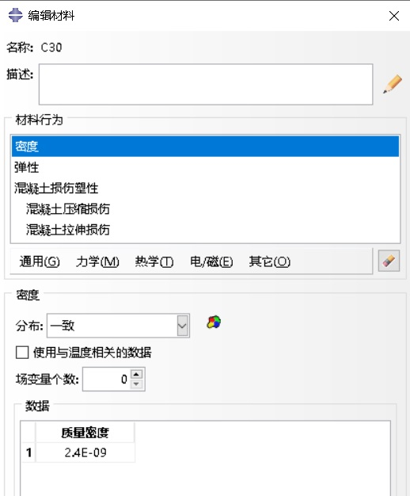       | 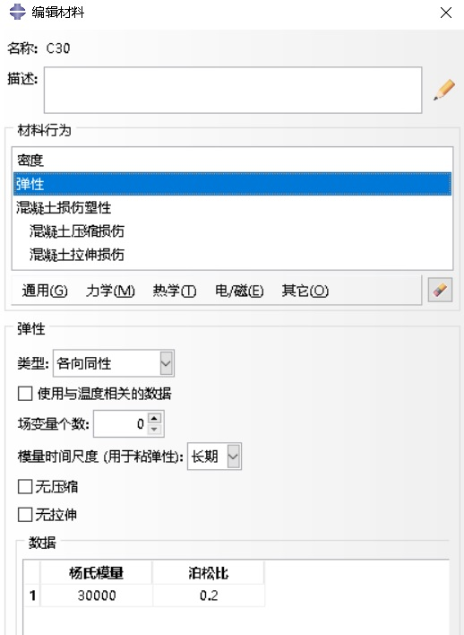         |
|----------------------------|------------------------------|
| <p align = "center">密度</p> | <p align = "center">弹性属性</p> |

|        | 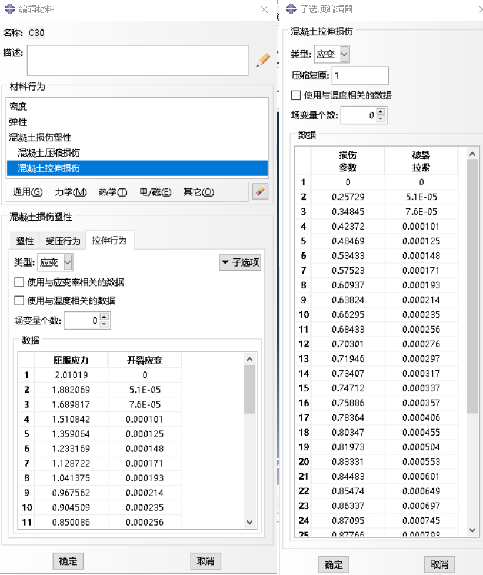       |
|------------------------------|------------------------------|
| <p align = "center">受压行为</p> | <p align = "center">受拉行为</p> |

## 建模策略

在 [PartsLib](../PyScripts/Library/PartsLib) 中存放相关部件的建模实现。

### 1. 钢筋网

在绘制单根钢筋后，可以使用 linearPattern 进行阵列操作，绘制多跟钢筋，这种方法绘制的钢筋间距是相同的。
``` python
sketch.linearPattern(geomList=(line,), vertexList=(),
                     number1=1, spacing1=100.0, angle1=0.0,
                     number2=num, spacing2=spacing, angle2=270.0)
```

在绘制多根钢筋后，在 z 方向上创建基准面，进入基准面草图后，可以在草图中用同样的方法创建上部的架立筋，创建箍筋的思路有所不同，生成矩形线部件，然后在装配中进行阵列并合并成箍筋网。最后将纵筋和箍筋装配在一起后合并成为钢筋网。

在这一过程中，考虑不同种类线部件之间多合并操作，将创建过程定为函数，封装在静态方法类 [Lines](../PyScripts/Library/PartsLib/lines.py) 中。

### 2. 简支梁

简支梁是一种矩形构件，故创建矩形部件类 Cube 后，SimplyBeam 类继承 Cube 实现简支梁模型在支座、跨中等处的分割操作，具体代码见 [solids.py](../PyScripts/Library/PartsLib/solids.py) 


分割操作多采用创建基准点后，点-法线分割，好处在于，方便在 GUI 中手动调整分割位置。
``` python
dp0 = part.DatumPointByCoordinate(coords=(0, y, height))
part.PartitionCellByPlanePointNormal(point=part.datums[dp0.id],
                                     normal=part.edges.findAt((1e-2, y, 0)),
                                     cells=part.cells)
```

### 3. 装配

ABAQUS 没有纵向（高度方向）的概念，因此可以选择 x、y、z 任意一个作为纵向，在本建模过程中，将 z 方向视作纵向进行装配。

计算相对位置，通过平移等变换，进行装配。装配以及之后的建模代码位于 [before.py](../PyScripts/SimplyBeamsTest/before.py)


### 4. 分析步、荷载、边界条件、相互作用

step1: 在一个分析步中创建重力荷载，大小 -9810 (N/tone)

step2: 第二个分析步施加外力，同样沿着 z 轴向下对构件进行施压。

三个模型各自有不同的荷载施加方式：
1. 对于均布荷载直接施加在梁的上表面
2. 对于单点跨中加载，在跨中上部放置一个的钢垫块，钢垫块下表面与梁的接触面进行绑定约束，上表面与 RP 参考点耦合，在参考点上施加荷载。
3. 对于三分点加载，在距跨中左右两侧 1 / 6 处各放置一个钢垫块，同样用耦合参考点。

对于边界条件，滚动支座需要放开 y 方向转动 (UR2) ，滑动铰支座需要放开 x 方向位移 (U1) 以及 y 方向转动。


``` python
model.DisplacementBC(name='BC-R',
                     createStepName=step0_name,
                     region=set_rp1,
                     u1=UNSET, u2=SET, u3=SET,
                     ur1=SET, ur2=UNSET, ur3=SET)

model.DisplacementBC(name='BC-L',
                     createStepName=step0_name,
                     region=set_rp0,
                     u1=SET, u2=SET, u3=SET, 
                     ur1=SET, ur2=UNSET, ur3=SET)
```

钢筋网应内置于梁中：


### 5. 输出
场输出与历程输出的区别在于，前者是空间状态下的，后者是时间状态下的，因此，场输出可以看到全过程的三维可视化，而历程输出针对单个点位的沿时间变化曲线。
正因如此，在关键点较少的情况下，场输出往往相比历程输出有着更大的计算量，绘制曲线多一个步骤，但是结果更全面。

为绘制梁的跨中荷载-位移曲线以及分析混凝土开裂状态，场输出需要添加位移 (U) 受拉损伤 ('DAMAGET') 和受压损伤 ('DAMAGEC') 两个变量。
历程输出中可以针对跨中节点的集合输出纵向位移，根据力的平衡，在忽略其他方向较小的反力情况下，对两个支座参考点的集合输出纵向反力，相加计算所受到的荷载。

历程输出代码：
``` python
model.HistoryOutputRequest(name='H-Output-1',
                           createStepName=step1,
                           variables=('U3',),
                           region=beam.sets['MidPoint'])

model.HistoryOutputRequest(name='H-Output-2',
                           createStepName=step1,
                           variables=('RF3',),
                           region=St.rp0)

model.HistoryOutputRequest(name='H-Output-3',
                           createStepName=step1,
                           variables=('RF3',),
                           region=St.rp1)
```

### 6. 网格划分

网格在考虑计算机性能和计算量的前提下，设置适当的网格大小，从面的网格建议比主面更加细密。

* 梁结构整体为矩形，单元类型为 C3D8R，网格大小为50
* 垫块 C3D8R，网格大小 25
* 钢筋网为桁架单元 T3D2，网格大小 50

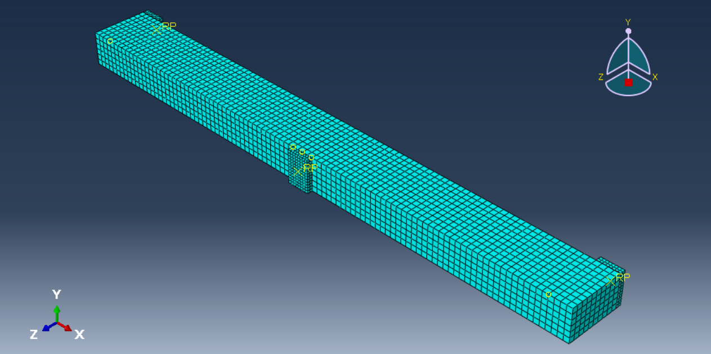

``` python
# 划分网格
t3d2 = mesh.ElemType(elemCode=T3D2, elemLibrary=STANDARD)

if P.beam.getMeshStats().numMeshedRegions == 0:
    P.beam.seedPart(size=beam_mesh_size, deviationFactor=0.1, minSizeFactor=0.1)
    P.beam.generateMesh()

if P.pad.getMeshStats().numMeshedRegions == 0:
    P.pad.seedPart(size=pad_mesh_size, deviationFactor=0.1, minSizeFactor=0.1)
    P.pad.generateMesh()

if P.rm.getMeshStats().numMeshedRegions == 0:
    P.rm.seedEdgeByNumber(edges=P.rm.edges, number=1, constraint=FINER)
    P.rm.setElementType(regions=regionToolset.Region(edges=P.rm.edges), elemTypes=(t3d2,))
    P.rm.generateMesh()
```
在二次开发中，三维实体默认是 C3D8R, 所以可以不用设置，而线部件默认为线性梁，对于钢筋网而言需要更改为 T3D2, 考虑作为桁架单元的钢筋主要承担轴向力，按数量布种，个数为1

### 7. 作业

布置作业，设置 4 核 CPU 参与运算（根据计算机实际情况定），可以提交计算，也可以之后在 GUI 中手动提交。

## 计算结果及后处理

##### 受拉损伤云图
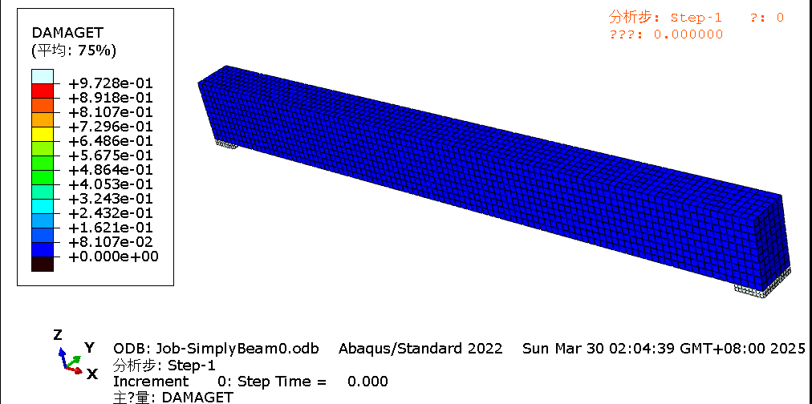
<p align = "center">均布加载</p>


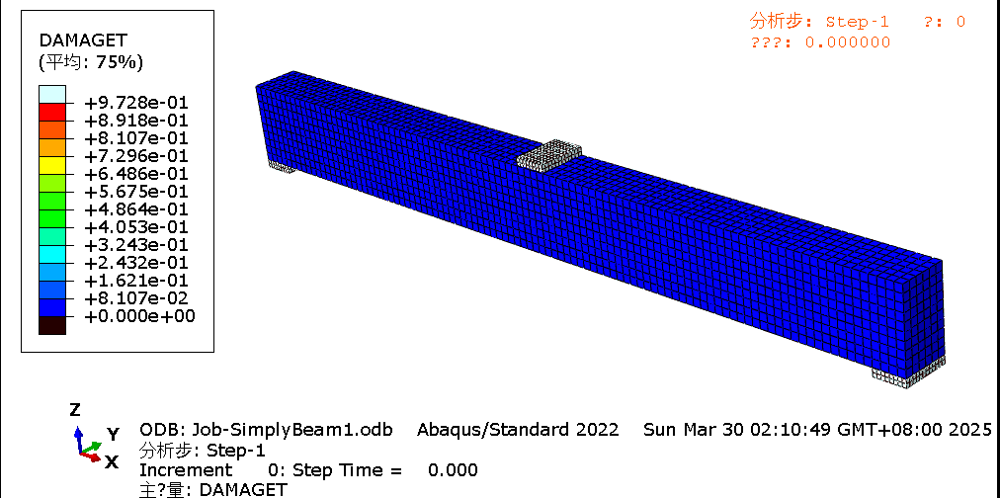
<p align = "center">跨中单点加载</p>


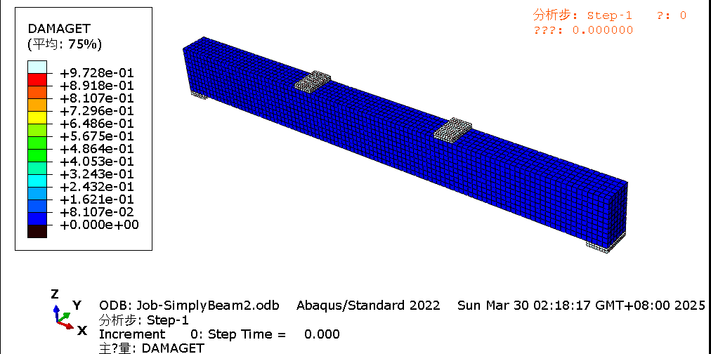
<p align = "center">三分点加载</p>

可以看到，损伤均发生在跨中，逐渐向梁两端延伸，表现出适筋破坏的特点。

运行后处理脚本 [after.py](../PyScripts/SimplyBeamsTest/after.py)，可以提取三种不同加载条件下梁的荷载位移数据，保存为.csv，再运行绘图脚本  [plot.py](../PyScripts/SimplyBeamsTest/plot.py), 可以绘制如下荷载-位移曲线。

<p align = "center">    

</p>

